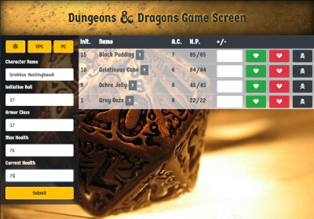
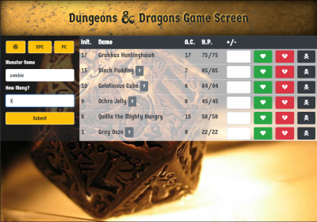
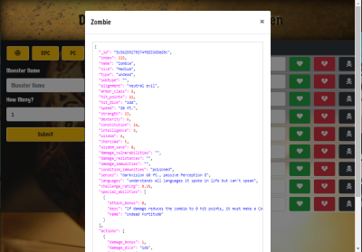
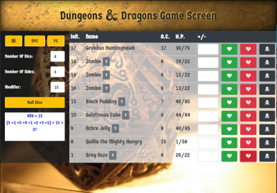

# dungeons-and-dragons

A continuation of group project #1 from my full stack web development boot camp [(original repo)](https://github.com/bryanbloomquist/group-project-1), a Dungeons and Dragons initiative tracker app.

## Let's Play!

Deployed App: [bryanbloomquist.github.io/dungeons-and-dragons](https://bryanbloomquist.github.io/dungeons-and-dragons)

## Project Description

An initiative combat tracker app for dungeon masters.  Keeps track of initiative and damage to party members and monsters.  Searches the SRD (Standard Reference Dictionary) from Wizards of the Coast for open source monsters to add to table with stats.  Forgot your dice, not a problem, you can even roll your dice with our app.

## Technologies USed

* HTML, CSS, Bootstrap, Javascript, jQuery, Firebase, Animate.css

## Roles

* Blake (Project Manager, Concept, Firebase) [(Portfolio)](https://blakedragos.github.io/Bootstrap-Portfolio.io/#) [(Github)](https://github.com/BlakeDragos)

* Bryan (Frontend, API, Firebase) [(Portfolio)](https://bryanbloomquist.com) [(Github)](https://github.com/bryanbloomquist)

* Britt (Styling) [(Github)](https://github.com/GitBrittG8)

* Bev (Frontend) [(Github)](https://github.com/BeckyTurner)

## Add a PC

)

## Add an NPC

)

## View NPC Stat Block

)

## Roll Some Dice

)

## Contributing 

Contributions are what make the open source community such an amazing place to be learn, inspire, and create. Any contributions you make are **greatly appreciated**.

1. Fork the Project
2. Create your Feature Branch (`git checkout -b feature/AmazingFeature`)
3. Commit your Changes (`git commit -m 'Add some AmazingFeature'`)
4. Push to the Branch (`git push origin feature/AmazingFeature`)
5. Open a Pull Request